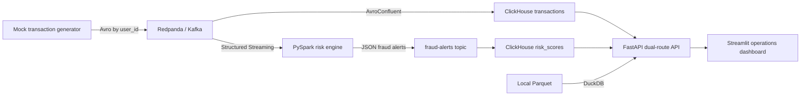

# Disvent

Disvent is a local real-time event-streaming and analytical engine for financial risk operations. It demonstrates the same core patterns used in high-throughput fintech and marketplace systems: partitioned event ingestion, stream processing, low-latency OLAP serving, historical audit queries, and an operator dashboard.

## Architecture



## What It Shows

- High-throughput event production with stable partition keys for user-level ordering.
- ClickHouse Kafka-engine ingestion into `ReplacingMergeTree` and materialized aggregate tables.
- Spark Structured Streaming with event-time windows, watermarking, configurable thresholds, and alert scoring.
- FastAPI query routing: ClickHouse for live metrics, DuckDB over Parquet for historical audit.
- A dashboard that surfaces health, throughput, merchant aggregates, risk timelines, and audit records.

## Quick Start

Install dependencies with `uv` once:

```bash
uv sync --all-packages
```

Start infrastructure:

```bash
make infra-up
```

Run the services in separate terminals:

```bash
make api
make dashboard
make generator
make stream
```

Useful URLs:

- API health: http://localhost:8001/api/v1/health
- API docs: http://localhost:8001/docs
- Dashboard: http://localhost:8501
- Redpanda Console: http://localhost:8086
- ClickHouse HTTP: http://localhost:8123

## Configuration

Common environment variables:

| Variable | Default | Used by |
| --- | --- | --- |
| `KAFKA_BOOTSTRAP_SERVERS` | `localhost:9092` | generator, streaming |
| `SCHEMA_REGISTRY_URL` | `http://localhost:8087` | generator |
| `TOPIC_NAME` | `financial-transactions` | generator, streaming |
| `ALERTS_TOPIC` | `fraud-alerts` | streaming |
| `TARGET_RATE_PER_SEC` | `2500` | generator |
| `MAX_MESSAGES` | `0` | generator, where `0` means unlimited |
| `RISK_AMOUNT_THRESHOLD` | `8000` | streaming |
| `RISK_COUNT_THRESHOLD` | `5` | streaming |
| `CLICKHOUSE_HOST` | `localhost` | API |
| `CLICKHOUSE_PORT` | `8123` | API |
| `PARQUET_DIR` | `/tmp/disvent-historical` | API |
| `API_URL` | `http://localhost:8001/api/v1` | dashboard |

## API Surface

- `GET /api/v1/health`
- `GET /api/v1/metrics/realtime-throughput`
- `GET /api/v1/merchant/{merchant_id}/stats?limit=24`
- `GET /api/v1/risk-score/{user_id}?limit=20`
- `GET /api/v1/historical/user/{user_id}`

## Verification

```bash
make test
```

For a full smoke test, start infrastructure and the API, then call:

```bash
curl http://localhost:8001/api/v1/health
```

The status may be `degraded` until ClickHouse finishes starting and the init SQL has run.

## Design Notes

Disvent intentionally keeps the local stack compact while preserving industry-grade boundaries:

- Redpanda decouples producers, stream processors, and OLAP ingestion.
- ClickHouse owns serving-time aggregates and recent alert analytics.
- Spark owns stateful event-time logic that would be awkward and expensive in a request path.
- DuckDB gives analysts a cheap local audit path over Parquet without loading ClickHouse.
- FastAPI hides storage choices behind a stable product API.

This makes the project useful as a portfolio system, a teaching lab, and a starting point for experiments in fraud scoring, dynamic pricing, IoT telemetry, or SLA monitoring.
