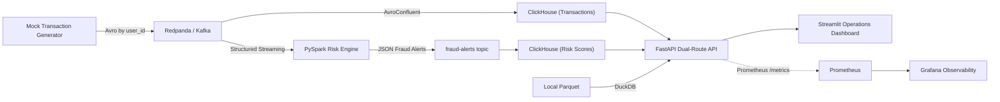

# Disvent: Real-Time Event-Streaming & Analytical Engine

Disvent is a local, industry-grade real-time event-streaming and analytical engine designed for financial risk operations and fraud detection. 

It implements the core architectural patterns used in high-throughput fintech and marketplace platforms: partitioned event ingestion, stateful stream processing, low-latency OLAP serving, historical audit querying, and a fully integrated observability stack.

## Architecture & Data Flow



## Key Capabilities

- **High-Throughput Ingestion**: Mock generator produces thousands of transactions per second with stable partition keys for strict user-level ordering.
- **Low-Latency OLAP**: Redpanda to ClickHouse Kafka-engine ingestion into `ReplacingMergeTree` and materialized aggregate tables.
- **Advanced PySpark Fraud Logic**: 
  - **Impossible Travel Detection**: Calculates geospatial distance (`latitude_spread` & `longitude_spread`) over rolling windows.
  - **Micro-Structuring Detection**: Flags high `approx_count_distinct` device fingerprints combined with rapid velocity across 10-minute sliding windows.
- **Secure Dual-Route API**: FastAPI exposes secure (`X-API-Key`) endpoints serving both live ClickHouse metrics and historical DuckDB parquet audits.
- **Comprehensive Observability**: Embedded Prometheus scraping and auto-provisioned Grafana dashboards tracking real-time pipeline throughput, latency, and detected anomalies.

## Quick Start

### 1. Prerequisites
Ensure you have Docker and [uv](https://docs.astral.sh/uv/) installed.

### 2. Boot the Entire Pipeline
The repository provides a complete, containerized stack. To boot everything (Redpanda, ClickHouse, Prometheus, Grafana, API, Dashboard, and PySpark Streaming):

```bash
make pipeline-up
```

*Wait approximately 30-45 seconds for ClickHouse schemas to initialize and Redpanda to finish booting.*

### 3. Verify Health & Integration
Run the automated smoke tests to ensure the API is securely connected to the databases and the streaming engine is healthy:

```bash
make smoke
```

### 4. Important Interfaces

- **Operations Dashboard (Streamlit)**: [http://localhost:8501](http://localhost:8501)
- **Grafana Observability**: [http://localhost:3000](http://localhost:3000) *(Default credentials: `admin` / `admin`)*
- **API Swagger Docs**: [http://localhost:8001/docs](http://localhost:8001/docs)
- **Redpanda Console**: [http://localhost:8086](http://localhost:8086)

## Configuration & Security

Disvent is secured by default. The API layer requires an authentication key for programmatic access. 

| Variable | Default / Expected | Description |
| --- | --- | --- |
| `DISVENT_AUTH_ENABLED` | `true` | Enforces `X-API-Key` headers on all endpoints |
| `DISVENT_API_KEY` | `dev-secret-key` | The required key for secure API routes |
| `KAFKA_BOOTSTRAP_SERVERS` | `redpanda:29092` | Kafka broker address |
| `TARGET_RATE_PER_SEC` | `2500` | Generator transaction throughput |
| `RISK_AMOUNT_THRESHOLD` | `8000` | PySpark fraud detection threshold (sum) |

## API Surface

- `GET /api/v1/health`
- `GET /api/v1/metrics/realtime-throughput`
- `GET /api/v1/merchant/{merchant_id}/stats?limit=24`
- `GET /api/v1/risk-score/{user_id}?limit=20`
- `GET /api/v1/archive/recent` *(DuckDB Parquet Audit)*

## Design Philosophy

Disvent intentionally keeps the local stack compact while rigidly enforcing production-grade boundaries:
- **Redpanda** acts as the immutable, decoupled backbone separating producers, processors, and OLAP ingestion.
- **ClickHouse** owns sub-second serving-time aggregates and recent fraud analytics.
- **PySpark** handles complex, stateful event-time windowing logic that is computationally prohibitive in a direct request path.
- **DuckDB** provides analysts an inexpensive local audit path over cheap object storage (Parquet) without burdening the live ClickHouse cluster.
- **FastAPI** encapsulates storage choices behind a stable product API.
- **Prometheus/Grafana** provide out-of-the-box visibility into system health and analytical throughput.
